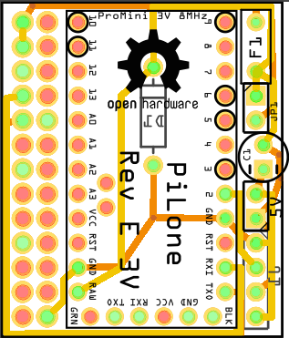

PiLone
======

PiLone is Open Source HardWare that allows quietly displaying various quantitative and/or time based data in the living room

DISCLAIMER
==========

BEWARE: This is currently a barely functionnal proto

BEWARE BEWARE: The provided PCB hasn't been fabed currently. Do not mass order one, it may not even work...

The provided software and attached hardware designs are provided as-is, with no waranty at all. It may catch fire, it may destroy components, it may not function as advertised, it hasn't been certified for anything (No CE markings, no FCC markings...). Take extreme care when using either software or hardware designs and make sure you fully understand the software and hardware before doing anything with it. You've been warned.

Made with...
============

Raspberry Pi is a trademark of the Raspberry Pi Foundation

Arduino Community is a trademark of Arduino SA

Licence
=======

All software in this repository is released under the GNU General Public Licence V3.0. You may find a copy online [there](http://opensource.org/licenses/GPL-3.0) or localy [here](./software-licence.txt)

All documentation, drawings, pictures, schematics, and more generaly all that is not a computer program or part of it is licenced under the Creative Commons CC-BY-SA V4.0 licence. You may find a copy of the licence [there](http://creativecommons.org/licenses/by-sa/4.0/) or localy [here](./hardware-licence.txt)

What is it?
===========

What's in here?
---------------

In this project, you will find how to plug a Raspberry Pi, an Arduino Pro Mini, and some Adafruit NeoPixels together, to make a connected object that can display time based, or quantitative, information in a beautifull way.

The two most important parts are:

- Some software to gather data and push it to pixels
- A custom PCB to hold the parts together

What can I build with it?
-------------------------

With those hardware designs and software, you may build a pretty connected object that displays various informations on LED strips, with all the ugly electronics parts encased in a PlexiGlass tube about 11cm diameter by 18cm height.

What information it may display depends entierly on your imagination, and programming skills. But here are two samples, provided in the sample software:

### Visual alarm clock

You may want a visual reminder of something in time, like, the hour at which your eldest child should leave to school. PiLone will start lighting its LED one by one ten minutes before the expected time, and then blink for five minutes when you're late. Now, he can't be late anymore: The more light you see, the more motivated he will be.

### Differential meteo

You may also want to know if you need an umbrella or your super insulating coat. But what's the point in pulling your very smart phone to know it's 18°C outside? Is it cold? And do you have time to do so? You'd better visually know if today is colder than yesterday, and with less rain. Differential meteo just does that: Display one or two, red or blue, dots for temperature, one for slighly different, two for really different, red for hotter, blue for warmer. And three light blue dots for the rain. One for light, two for serious, three for the apocalypse. Now, you just know: Umbrella, no coat.

### Combine them

Because your PiLone is made of sticks, three of them, you can choose which is better for the task. Lets say, meteo closer to the umbrella, and alarm clock from your kitchen table. So you see what you need where your need it. But there's more: Each stick is independent. That means, if you need the meteo while your son need alarm clock, just display both.

Why?
====

I started this project when I realized I wanted something able to push some information to me, silently, quietly, not on my phone, nor my computer. Something the old Nabaztag did perfectly until it died, and without the bugs.

I already had, as most of my fellow geek friends, a Raspberry Pi. I wanted to learn some Arduino to understand the buzz. And I liked the way NeoPixel sticks can display efficiently information. I had to plug it all together.

Requirements
============

Hardware parts
--------------

- 1x Raspberry Pi model B rev. 2 ([SparkFun](https://www.sparkfun.com/products/11546))
- 1x SD-Card (any size will do, as long as your Linux fits in. >4Gb recommended)
- 1x SparkFun Arduino Pro Mini 5v 16MHz ([SparkFun](https://www.sparkfun.com/products/11113))
- 3x Adafruit Technology High Density NeoPixel Sticks (or less, at least one) (or any other WS-2812 controlled 5050 RGB LED strip or - stick) ([SparkFun](https://www.sparkfun.com/products/12661))
- 1x custom made PCB (you may have the one [here](./hardware/PiLone‰20rev‰20E%203v%20low%20spec.fzz) made at Fritzing Fab, for instance, or build it - yourself if you have time, patience, skills, and something to print, cut, drill small, two-sided PCBs)
- 1x 2x13, 0.1' spaced, shrouded header ([SparkFun](https://www.sparkfun.com/products/11490)) or 2x13, 0.1' spaced, female header ([SparkFun](https://www.sparkfun.com/products/11765))
- 1x USB cable type-A to micro type-B as short as possible (30cm will do) ([SparkFun](https://www.sparkfun.com/products/10215))
- 1x FTDI-to-USB converter (SparkFun's works perfectly, any clone will do) ([SparkFun](https://www.sparkfun.com/products/9716) or get a friend to program your Arduino for you)
- 1x 5V 2A 3.5mm power supply ([SparkFun](https://www.sparkfun.com/products/12889))
- 1x 3.5mm power jack socket ([SparkFun](https://www.sparkfun.com/products/119))
- 1x straight USB type-A female connector
- 3x 4-pin, 0.1' spaced, male pins ([SparkFun](https://www.sparkfun.com/products/116))
- 3x 4-pin, 0.1' spaced, female-to-wire cables ([SparkFun](https://www.sparkfun.com/products/10364))
- Some soldering material and tooling

Total expected bill: under 100€ including taxes and customs, depending on shipping costs (group your packages!)

Software parts
--------------

- Linux installed on the SD-Card (any standard distribution will do, tested on Raspbian)
- Python 2.7.x (most probably already installed)
- PySerial (install with `pip install pyserial`)
- [optional] BottlePy (intall with `pip install bottle`) (if you need test.py to play with LED colors by hand, to check your hardware is well built)
- UART console disabled, reconfigured as serial port ([Tooling and manual there](https://github.com/lurch/rpi-serial-console))
- [optional] [Fritzing](http://fritzing.org/home/) to work on PCB design
- [optional] [SketchUp](http://www.sketchup.com) to work on case design and see real world assembly

TODO
====

Comming next are some instructions on how to assemble the thing (have a look at the provided breadboard view to get a glimpse)

Then, some more on how to run it

Then, something on the software architecture and what could be done with it really easily

Finally, a better designed (completed design? 3d-printable, laser cut?) case to hold it

